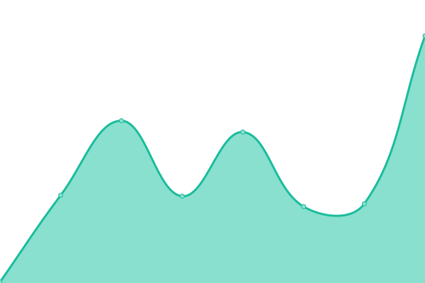
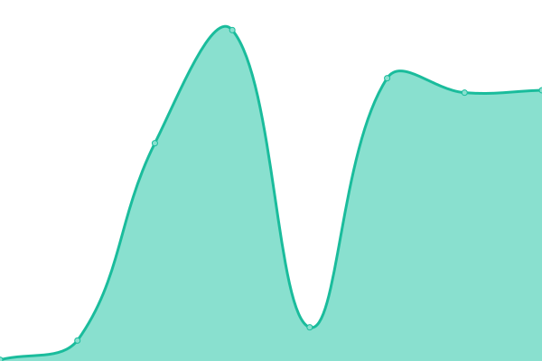
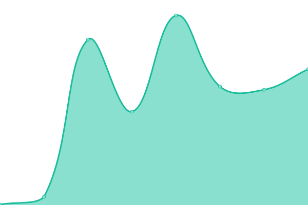

# [📈 Live Status](https://badges.github.io/uptime-monitoring): <!--live status--> **🟩 All systems operational**

This repository contains the open-source uptime monitor and status page for [Shields.io](http://shields.io/), powered by [Upptime](https://github.com/upptime/upptime).

With [Upptime](https://upptime.js.org), you can get your own unlimited and free uptime monitor and status page, powered entirely by a GitHub repository. We use [Issues](https://github.com/badges/uptime-monitoring/issues) as incident reports, [Actions](https://github.com/badges/uptime-monitoring/actions) as uptime monitors, and [Pages](https://badges.github.io/uptime-monitoring) for the status page.

<!--start: status pages-->
<!-- This summary is generated by Upptime (https://github.com/upptime/upptime) -->
<!-- Do not edit this manually, your changes will be overwritten -->
<!-- prettier-ignore -->
| URL | Status | History | Response Time | Uptime |
| --- | ------ | ------- | ------------- | ------ |
|  [Shields.io homepage](https://shields.io/) | 🟩 Up | [shields-io-homepage.yml](https://github.com/badges/uptime-monitoring/commits/HEAD/history/shields-io-homepage.yml) | 

 138ms
     
 | 

<a href="https://badges.github.io/uptime-monitoring/history/shields-io-homepage">100.00%</a>
    

|  [Static Badge](https://img.shields.io/badge/foo-bar-blue) | 🟩 Up | [static-badge.yml](https://github.com/badges/uptime-monitoring/commits/HEAD/history/static-badge.yml) | 

 109ms
     
 | 

<a href="https://badges.github.io/uptime-monitoring/history/static-badge">100.00%</a>
    

|  [NPM version badge](https://img.shields.io/npm/v/badge-maker) | 🟩 Up | [npm-version-badge.yml](https://github.com/badges/uptime-monitoring/commits/HEAD/history/npm-version-badge.yml) | 

 172ms
     
 | 

<a href="https://badges.github.io/uptime-monitoring/history/npm-version-badge">100.00%</a>
    

|  [GitHub issues badge](https://img.shields.io/github/issues-search?query=repo%3Abadges%2Fshields) | 🟩 Up | [git-hub-issues-badge.yml](https://github.com/badges/uptime-monitoring/commits/HEAD/history/git-hub-issues-badge.yml) | 

 212ms
     
 | 

<a href="https://badges.github.io/uptime-monitoring/history/git-hub-issues-badge">100.00%</a>
    

<!--end: status pages-->

[**Visit our status website →**](https://badges.github.io/uptime-monitoring)

## 📄 License

- Powered by: [Upptime](https://github.com/upptime/upptime)
- Code: [MIT](./LICENSE) © [Anand Chowdhary](https://anandchowdhary.com), supported by [Pabio](https://pabio.com)
- Data in the `./history` directory: [Open Database License](https://opendatacommons.org/licenses/odbl/1-0/)
